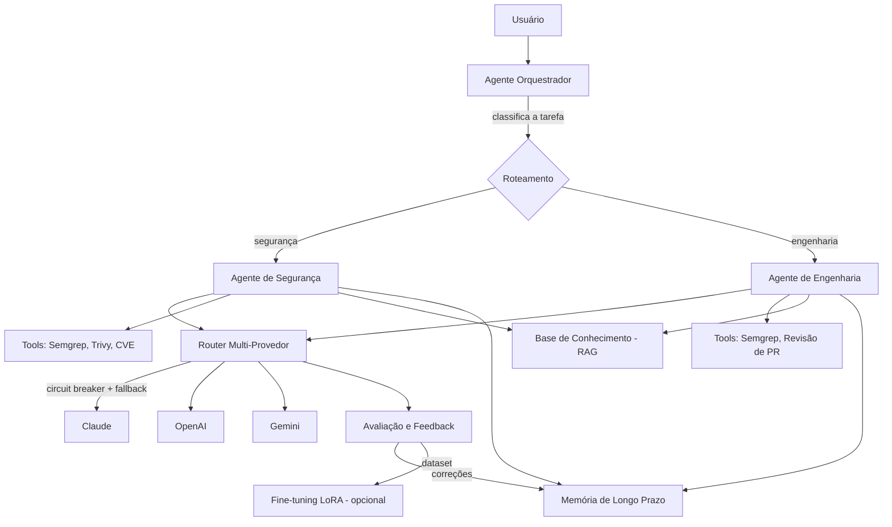

# CloneAI

Agente de IA multi-provedor com roteamento inteligente, RAG, memória de longo prazo, ferramentas de análise de segurança (SAST/SCA) e orquestração multi-agente — evoluído de um chatbot multi-modelo para um agente capaz de executar tarefas reais.

> Este projeto documenta não só o "o quê", mas o **"por quê"** de cada decisão de arquitetura — a intenção é que sirva tanto como ferramenta funcional quanto como material de estudo/portfólio em engenharia de software e segurança aplicada.

---

## Índice

- [Visão geral](#visão-geral)
- [Arquitetura](#arquitetura)
- [Módulos](#módulos)
- [Stack técnica](#stack-técnica)
- [Instalação](#instalação)
- [Uso rápido](#uso-rápido)
- [Decisões de design](#decisões-de-design)
- [Testes e validação](#testes-e-validação)
- [Segurança do próprio agente](#segurança-do-próprio-agente)
- [Roadmap](#roadmap)
- [Licença](#licença)

---

## Visão geral

O CloneAI começou como um chatbot com acesso a múltiplos modelos de IA (GPT, Claude, Gemini, Llama, DeepSeek, Mistral) e evoluiu para um **agente** — ou seja, um sistema capaz de:

- Decidir quando e quais ferramentas usar (tool calling) em vez de só responder texto
- Buscar conhecimento externo antes de responder (RAG)
- Lembrar de contexto entre sessões diferentes (memória de longo prazo)
- Executar análises reais de segurança em código e dependências (Semgrep, Trivy)
- Rotear entre provedores de IA com fallback automático (circuit breaker)
- Delegar tarefas para sub-agentes especializados (orquestração multi-agente)
- Registrar e avaliar sistematicamente a própria qualidade (loop de feedback)

## Status: o que é real e o que é demo/mock

Documentar isso explicitamente é uma prática deliberada, não uma fraqueza do projeto — um painel funcional que mostra dado real vale mais para avaliação técnica do que uma interface completa que finge ter dado por trás. Abaixo, o status honesto de cada peça:

| Funcionalidade | Status | Observação |
|---|---|---|
| Chat multi-provedor (Claude/GPT/Gemini) | 🟢 Real | Roteado via Cloud Function, chaves protegidas no backend |
| Circuit breaker por provedor | 🟢 Real | Estado lido/escrito no Firestore a cada chamada |
| Telemetria (requisições, custo, latência) | 🟢 Real | Gravada pela Cloud Function, não pelo cliente — não pode ser falsificada pelo navegador |
| Feed de CVEs (NVD API) | 🟢 Real | Atualizado a cada 6h via function agendada |
| Exploit conhecido (CISA KEV) | 🟢 Real | Cruza CVEs com o catálogo oficial de vulnerabilidades exploradas ativamente |
| Notícias de segurança (RSS) | 🟢 Real | The Hacker News, BleepingComputer, Krebs on Security |
| RAG (busca vetorial) | 🟡 Implementado, sem dado ainda | Estrutura pronta (Firestore vector search); base ainda não populada com documentos reais |
| Memória de longo prazo | 🟡 Implementado, sem dado ainda | Painel funcional; ainda sem fatos reais salvos em uso contínuo |
| Fine-tuning (LoRA) | 🟡 Estrutura pronta, não executado | Depende de volume de dados de correção — só compensa com uso real acumulado |
| **"Simulador de Agente Robot" / Rastreador de Robôs SEO** | 🔴 **Demo/Mock** | O terminal de "tráfego de robôs" e o disparo de "varredura" são simulados para fins de demonstração de conceito de indexação por IA (GEO/AEO) — **não representa tráfego real de crawlers** |
| Scanners de segurança (Semgrep/Trivy) | 🟡 Módulo pronto, não integrado à UI | Implementado como função Python separada; falta plugar na interface |

Legenda: 🟢 real e em produção · 🟡 implementado mas sem dado real ainda / não integrado · 🔴 mock, existe só para demonstrar o conceito.

## Arquitetura



## Módulos

| Módulo | Arquivo | Responsabilidade |
|---|---|---|
| Loop do agente (single-provider) | `agent_loop.py` | Implementação de referência do loop pergunta → tool → resposta |
| Router multi-provedor | `agent_loop_multiprovider.py` | Adapta Claude/OpenAI/Gemini a uma interface comum + circuit breaker |
| RAG | `rag_module.py` | Base de conhecimento vetorial local (ChromaDB) exposta como tool |
| Memória de longo prazo | `memory_module.py` | Fatos sobre usuário/projeto, recuperados por relevância semântica |
| Scanners de segurança | `tools_scanners.py` | Integração real com Semgrep (SAST) e Trivy (SCA) |
| Avaliação e feedback | `eval_module.py` | Log estruturado de interações + aprovação manual + exportação de dataset |
| Fine-tuning (LoRA) | `finetuning_module.py` | Especialização leve de modelo pequeno a partir do dataset de correções |
| Orquestração multi-agente | `multi_agent_module.py` | Delega tarefas para sub-agentes especializados (segurança/engenharia) |
| Testes de validação | `testes_validacao.py` | Casos de teste reais (incluindo falso-positivo e prompt injection) |

## Stack técnica

- **Linguagem**: Python
- **LLMs**: Claude (Anthropic), GPT (OpenAI), Gemini (Google) — via API
- **RAG/Vetores**: ChromaDB (embedding local, sem custo de API)
- **Persistência**: SQLite (avaliação), ChromaDB (RAG + memória)
- **Segurança**: Semgrep (SAST), Trivy (SCA/containers)
- **Fine-tuning**: Hugging Face `transformers` + `peft` (LoRA)

## Instalação

```bash
git clone <seu-repositorio>
cd cloneai

pip install anthropic openai google-generativeai chromadb semgrep

# Trivy é um binário separado — instale conforme seu SO:
# https://aquasecurity.github.io/trivy/latest/getting-started/installation/

export ANTHROPIC_API_KEY="..."
export OPENAI_API_KEY="..."
export GOOGLE_API_KEY="..."
```

## Uso rápido

```python
from multi_agent_module import AgenteOrquestrador

orquestrador = AgenteOrquestrador()
resultado = orquestrador.rodar("Essa CVE-2021-44228 é crítica?")

print(resultado["agente_usado"])   # agente_seguranca
print(resultado["resposta"])
```

## Decisões de design

Documentar o *porquê*, não só o *como* — é isso que diferencia arquitetura pensada de código copiado:

- **Circuit breaker por provedor, não por request**: evita retry cego em um provedor fora do ar; após 3 falhas consecutivas o provedor é marcado `OPEN` e o router pula automaticamente para o próximo, sem intervenção manual.
- **Router escolhe um provedor por tarefa completa, não por chamada**: cada API tem formato próprio de `tool_use_id`/`tool_call_id`; trocar de provedor no meio de uma cadeia de tool-calling quebraria o encadeamento.
- **RAG e memória são bases separadas**: RAG guarda conhecimento externo (o que existe no mundo); memória guarda fatos sobre o usuário/projeto (o que o agente aprendeu especificamente). Misturar as duas degradaria a relevância da busca em ambas.
- **Correções viram memória automaticamente**: toda vez que uma resposta é reprovada com uma correção explícita, ela é salva como fato de memória categoria `correcao` — o agente não repete o mesmo erro na próxima conversa, sem precisar de fine-tuning para isso.
- **Fine-tuning é a última peça, não a primeira**: só compensa com volume real de dados de correção (o código sinaliza isso explicitamente); antes disso, ajustar prompt rende mais por menos esforço.

## Testes e validação

`testes_validacao.py` cobre, deliberadamente:
- Casos "felizes" (código vulnerável detectado corretamente)
- **Falsos positivos** (código limpo que não deveria gerar alarme)
- Casos ambíguos de roteamento (a tarefa poderia ir para qualquer um dos sub-agentes)
- **Prompt injection** contra o próprio agente
- Ausência de dado (pergunta sobre CVE inexistente — o agente deve admitir que não sabe, não alucinar)

## Segurança do próprio agente

Pontos verificados/a verificar continuamente:
- [ ] Chaves de API (`GOOGLE_TTS_API_KEY`, `ELEVENLABS_API_KEY` etc.) nunca expostas client-side
- [ ] Resistência a prompt injection (testado em `testes_validacao.py`)
- [ ] Guardrail de confirmação antes de tools que executam ações reais/sensíveis
- [ ] Rate limiting por usuário para evitar abuso de custo de API

## Roadmap

- [x] Tool calling básico
- [x] Loop de agente multi-provedor com fallback — **real**, com telemetria gravada em produção
- [x] Feed de CVEs real (NVD API + CISA KEV) e notícias de segurança (RSS)
- [ ] RAG — estrutura implementada, pendente de popular com documentos reais
- [ ] Memória de longo prazo — estrutura implementada, pendente de uso contínuo real
- [ ] Scanners de segurança reais (Semgrep, Trivy) — módulo pronto, falta integrar na UI
- [x] Loop de avaliação e feedback
- [ ] Fine-tuning leve (LoRA) — estrutura pronta, pendente de volume real de dados de correção
- [x] Orquestração multi-agente
- [ ] Interface de feedback (👍/👎) integrada na UI
- [ ] Execução paralela de conversas (requer isolar estado por sessão)
- [ ] Substituir "Simulador de Agente Robot" por indexação real, ou remover/rotular como protótipo conceitual

## Licença

Este projeto está licenciado sob a licença MIT — veja o arquivo
[LICENSE](LICENSE) para mais detalhes.
